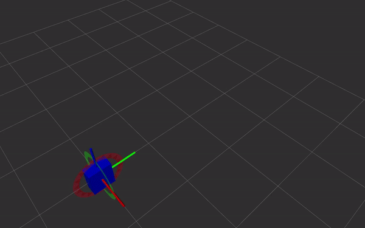

# Dual Quaternions


Dual quaternions are a way of representing rigid body transformations, just like homogeneous transformations do. Instead of using a 4x4 matrix, the transformation is represented as two quaternions. This has several advantages, which are listed under [Why use dual quaternions?](#why-use-dual-quaternions). The term 'dual' refers to dual number theory, which allows representing numbers (or in this case quaternions) very similar to complex numbers, with the difference being that `i` or `j` becomes `e` (epsilon), and instead of `i^2 = -1`, we have `e^2 = 0`. This allows, for example, the multiplication of two dual quaternions to work in the same way as homogeneous matrix multiplication.

For more information on dual quaternions, take a look at the [References](#references).
For conversion from and to common ROS messages, see [dual_quaternions_ros](https://github.com/Achllle/dual_quaternions_ros>).

[](https://gist.github.com/Achllle/c06c7a9b6706d4942fdc2e198119f0a2)

## Why use dual quaternions?

* dual quaternions have all the advantages of quaternions including unambiguous representation, no gimbal lock, compact representation
* direct and simple relation with screw theory. Simple and fast Screw Linear Interpolation (ScLERP) which is shortest path on the manifold
* dual quaternions have an exact tangent / derivative due to dual number theory (higher order taylor series are exactly zero)
* we want to use quaternions but they can only handle rotation. Dual quaternions are the correct extension to handle translations as well.
* easy normalization. Homogeneous tranformation matrices are orthogonal and due to floating point errors operations on them often result in matrices that need to be renormalized. This can be done using the Gram-Schmidt method but that is a slow algorithm. Quaternion normalization is very fast.
* mathematically pleasing

## Installation

```bash
pip install dual_quaternions
```

## Usage

```python
from dual_quaternions import DualQuaternion
```

## References

* \K. Daniilidis, E. Bayro-Corrochano, "The dual quaternion approach to hand-eye calibration", IEEE International Conference on Pattern Recognition, 1996
* Kavan, Ladislav & Collins, Steven & Zara, Jiri & O'Sullivan, Carol. (2007). Skinning with dual quaternions. I3D. 39-46. 10.1145/1230100.1230107.
* Kenwright, B. (2012). A Beginners Guide to Dual-Quaternions What They Are, How They Work, and How to Use Them for 3D Character Hierarchies.
* Furrer, Fadri & Fehr, Marius & Novkovic, Tonci & Sommer, Hannes & Gilitschenski, Igor & Siegwart, Roland. (2018). Evaluation of Combined Time-Offset Estimation and Hand-Eye Calibration on Robotic Datasets. 145-159. 10.1007/978-3-319-67361-5_10.

## Other dual quaternion libraries

Many libraries focus on efficiency and are written in C++, sometimes with Python bindings. They typically do not include tests and so it's hard to know whether they're accurate. Along with a test suite, this library aims to explain the various functions and why they're implemented that way. As a result it serves as a starting point for those trying to get started with dual quaternions.

* [Hasenpfote/dualquat](https://github.com/Hasenpfote/dualquat): C++, header-only using Eigen
* [neka-nat/dq3d](https://github.com/neka-nat/dq3d): C++ based, using Eigen, with Python bindings including examples for ScLERP and skinning
* [dqrobotics](https://dqrobotics.github.io/): Matlab, C++11 with Python3 bindings, includes docstrings

## Derivations

### log and exp

The exponential map is a map from the tangent space at some point x on the manifold onto its Lie group. It maps a vector $s$ such that the geodesic through $x$ is followed.
At the identity, $exp_1(s) =: exp(s)$ where $s$ is a pure dual quaternion (real part of $q_r$ and $q_d$ are zero)
At some point $x$, using parallel transport the map becomes $\exp_x(s) = x \cdot \exp_1(x^{-1} \cdot s)$
Intuitively, because $\exp$ is only defined at the identity but we're trying to find the map at some other point $x$, we first move it to the origin by premultiplying with $x^{-1}$. Then we map it to the manifold/Lie group using the exponential map, and finally move it back to $x$ by premultiplying by $x$.

* exp: $\mathfrak{se}(3) \rightarrow SE(3)$
  * takes elements from the Lie algebra to the manifold
* log: $SE(3) \rightarrow \mathfrak{se}(3)$
  * takes elements from the manifold to the Lie Algebra

In some sources log and exp are derived using the Taylor method first order approximation $f(a+\epsilon b) \~= f(a)+\epsilon b f'(a)$
Applying this to the log and exp functions, you would get:

```math
exp(r+\epsilon d) = exp(r)+\epsilon \cdot exp(r) \cdot d \\
log(r+\epsilon d) = log(r)+\epsilon \cdot r^{-1}\cdot d
```

where $r^{-1}=r^*$ since $r$ is unit.
This only gives the same answer as the Lie algebra formulation when the dual part is symmetric with respect to the real part, i.e. $d \cdot r^* = r^* \cdot d$
For nontrivial rotation and translation not aligned with the rotation axis, this is not the case. This is because the Taylor approximation assumes commutativity, which dual quaternion multiplication is not. As a result, the Taylor method can produce non-symmetric, non-pure dual quaternions which is not 'correct'.
